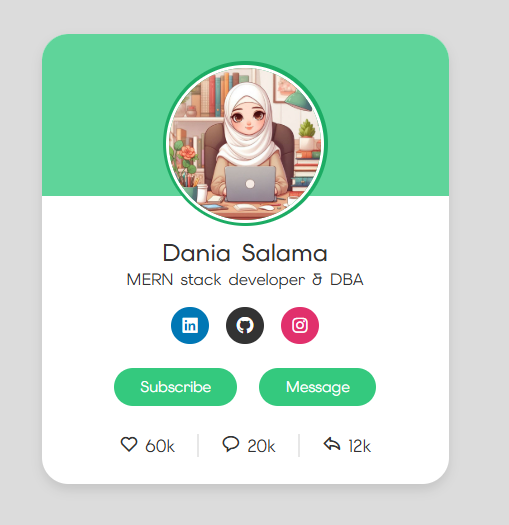

# Responsive-Profile-Card

"A sleek, responsive Profile Card UI built using HTML5 and CSS3. This project focuses on clean aesthetics and smooth user experience."

## 🚀 Technologies Used

**HTML5**: For the structural layout of the calculator.  
**CSS3**: For styling, Flexbox/Grid layouts, and modern UI design.  
**ICONS**: I use "Boxicons" wepsite for Icons.

## 👥 Authors

- **Dania Salama** - [DaniaSalamadr4](https://github.com/DaniaSalamhdr4)
